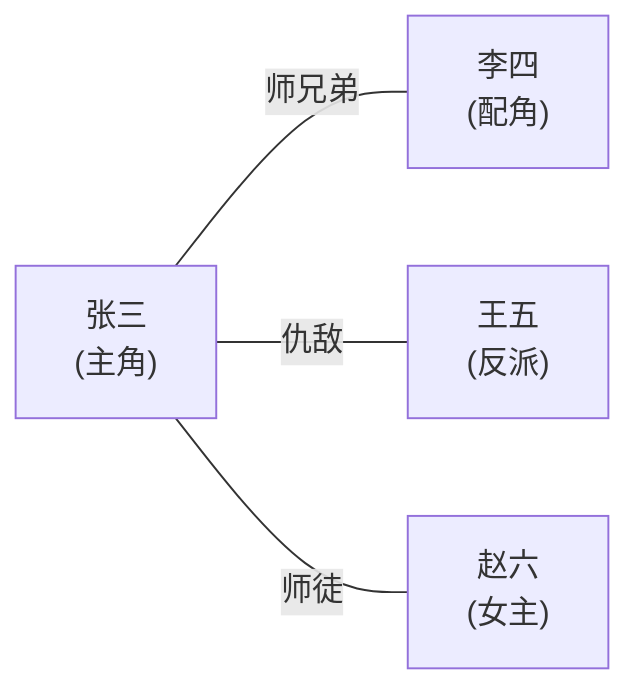
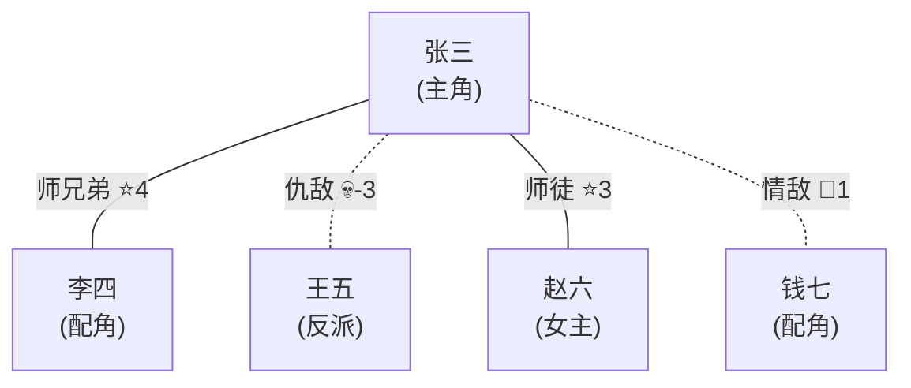

# 任务

生成角色关系图谱。

## 前置检查

1. 读取 `.current.yaml` 获取 `current_path`

## 输入参数

- `$0` (character): 可选，指定查看某角色的关系网

## 执行步骤

### 1. 获取角色列表

读取 `{current_path}/characters/character_index.yaml` 的 `entries` 列表获取全部角色。若索引文件不存在，扫描 `{current_path}/characters/*.yaml` 中的角色卡。

### 2. 提取关系信息

遍历所有角色卡片，提取「人物关系」部分。

### 3. 构建关系图

生成 Mermaid 格式关系图（可在 Markdown 预览器、Cursor、GitHub 等环境中直接渲染）。

同时提供文本摘要作为备选。

## 输出格式

**全局视图：**

````
📊 角色关系图谱



关系详情：
- 张三 ↔ 李四：师兄弟
- 张三 ↔ 王五：仇敌（张三杀了王五父亲）
- 张三 ↔ 赵六：师徒（赵六是师父）
````

Mermaid 图生成规则：
- 节点标签包含角色名和定位
- 边标签使用关系类型
- 关系强度 ≥ 4 使用粗线（`===`），≤ 1 或负值使用虚线（`-.-`）
- 敌对关系用红色标注（`style` 或 `:::danger`）

**单角色视图：**

````
📊 张三的关系网


````

## 注意事项

- 优先输出 Mermaid 格式，兼顾文本摘要
- 关系复杂时按势力或阵营分组（使用 Mermaid 的 `subgraph`）
- 强度信息从 `relations.yaml` 读取
- 支持按角色筛选