# 项目导读

> 给习惯了 `index.js → router → components` 的前端开发者：  
> 这个项目没有入口文件，也没有运行时。它是一套**指令集**——AI 读了指令，对你的小说文件做操作。  
> 把它想成一个"只有 API 文档、没有服务器"的项目。

---

## 一、心智模型：三个类比帮你切换视角

| 前端项目 | 本项目 | 说明 |
|----------|--------|------|
| `index.js` 入口 | `.current.yaml` + `.projects.yaml` | 没有代码入口，但有"当前状态入口"——AI 读这两个文件确定操作哪个项目 |
| `src/components/*.tsx` | `.claude/skills/*/SKILL.md` | 每个 SKILL.md 就是一个"函数定义"，告诉 AI 该怎么做 |
| `src/hooks/useXxx.ts` | `.claude/skills/_protocols/*.md` | 跨 skill 复用的行为规则，类似 React hooks 或 middleware |
| `src/pages/` (路由) | `pipeline-*` skills | Pipeline 是"页面级编排"，把多个原子 skill 串成完整工作流 |
| `public/` 或 `assets/` | `templates/project/` | 模板文件，新建项目时被复制为初始骨架 |
| `package.json` | `docs/SPEC.md` | 所有 skill 的清单和参数，相当于"API 目录" |
| `README.md` | `README.md` / `README-AUTHOR.md` | 使用说明 |
| 数据库 / API 返回值 | `projects/{书名}/` 下的 YAML + Markdown | 所有数据都是文本文件，没有数据库 |
| `.env` | `.novel/meta.yaml` + `.novel/state.yaml` | 项目配置和运行状态 |

**核心差异**：前端项目有运行时（浏览器执行代码），这个项目没有——AI 就是运行时。SKILL.md 里的指令是给 AI 看的"伪代码"，不是给机器执行的真代码。

---

## 二、从哪里开始读

### 路线 A：我想知道"系统能做什么"（5 分钟）

```
README.md          → 能力概览和快速上手
  ↓
README-AUTHOR.md   → 作为作者，我常用哪些命令
  ↓
docs/USAGE-GUIDE.md → 按场景查"我该用什么命令"
```

### 路线 B：我想理解"系统怎么运转的"（15 分钟）

```
本文件 (GUIDE.md)  → 你正在读的，建立心智模型
  ↓
ARCHITECTURE.md    → 系统分层 + 15 条架构决策记录（ADR）
  ↓
docs/SPEC.md       → 所有 skill 的参数和行为契约
```

### 路线 C：我想搞懂"某个具体流程"

直接读对应的 Pipeline SKILL.md（下面有完整列表），Pipeline 会引用它调用的所有子 skill。

---

## 三、项目目录结构

```
novel/                              ← 仓库根目录
├── .claude/skills/                 ← 🔑 所有 skill 定义（系统的"源码"）
│   ├── _protocols/                 ←   跨 skill 共享的行为协议
│   ├── chapter-*/                  ←   章节相关 skill
│   ├── character-*/                ←   角色相关 skill
│   ├── plot-*/                     ←   大纲相关 skill
│   ├── hook-*/                     ←   伏笔/钩子 skill
│   ├── setting-*/                  ←   设定相关 skill
│   ├── relationship-*/             ←   关系相关 skill
│   ├── timeline-*/                 ←   时间线 skill
│   ├── pipeline-*/                 ←   流程编排（组合多个原子 skill）
│   ├── novel-*/                    ←   项目管理 skill
│   ├── anti-ai-* / voice-* / style-*  ← 写作质量 skill
│   ├── inspiration-* / material-*  ←   素材与合规 skill
│   └── ...
├── .cursor/rules/                  ← Cursor IDE 的自动加载规则（勿手动编辑）
├── templates/project/              ← 新项目模板骨架
├── projects/                       ← 所有小说项目的数据目录
│   └── {书名}/                     ←   每本书一个子目录
│       ├── .novel/                 ←     项目配置 (meta.yaml, state.yaml, ops_log.yaml)
│       ├── characters/             ←     角色档案
│       ├── chapters/               ←     章节正文 + 索引
│       ├── plot/                   ←     大纲 + 钩子
│       ├── timeline/               ←     时间线
│       ├── worldbuilding/          ←     世界观设定集
│       ├── scenes/                 ←     场景档案
│       ├── compliance/             ←     借鉴日志与风险报告
│       ├── quality/                ←     AI 痕迹检测报告
│       └── shared/styles/          ←     风格模板
├── docs/                           ← 用户文档 (SPEC, USAGE-GUIDE, pipeline 设计)
├── .current.yaml                   ← 当前激活的项目指针
├── .projects.yaml                  ← 所有项目列表
├── ARCHITECTURE.md                 ← 架构文档 + ADR
└── AGENTS.md                       ← AI 导航入口
```

---

## 四、四层架构

```
┌──────────────────────────────────────────────────────┐
│  Layer 4: Pipeline（编排层）                          │
│  pipeline-chapter-kickoff, pipeline-draft-polish ...  │
│  把多个原子 skill 串成端到端工作流                      │
├──────────────────────────────────────────────────────┤
│  Layer 3: Atomic Skill（原子操作层）                   │
│  chapter-draft, character-add, setting-edit ...       │
│  每个 skill 做一件具体的事                              │
├──────────────────────────────────────────────────────┤
│  Layer 2: Protocol（行为契约层）                       │
│  draft-primacy, name-resolution, preflight-integrity  │
│  跨 skill 的共享规则，嵌入到 skill 内部执行              │
├──────────────────────────────────────────────────────┤
│  Layer 1: Data（数据层）                              │
│  YAML + Markdown 文件                                │
│  characters/*.yaml, chapters/*.md, plot/outline.md    │
└──────────────────────────────────────────────────────┘
```

**调用方向**：Pipeline → Atomic Skill → Protocol（内嵌）→ Data  
**反向不存在**：Protocol 不调用 Skill，Data 不调用任何东西。

---

## 五、Skill 完整清单（按领域分组）

### 项目管理（9 个）

| Skill | 一句话说明 | 类型 |
|-------|-----------|------|
| `novel-init` | 创建新小说项目 | 写 |
| `novel-edit` | 编辑项目基础信息 | 写 |
| `novel-list` | 列出所有项目 | 读 |
| `novel-switch` | 切换当前项目 | 写 |
| `novel-status` | 查看项目详细状态 | 读 |
| `novel-doctor` | 诊断项目健康（含知识新鲜度） | 读 |
| `novel-kpi` | 计算项目 KPI | 读 |
| `project-lint` | 机械化验证文件完整性和索引一致性 | 读/写（--fix） |
| `project-reindex` | 重建交叉索引 | 写 |
| `project-weekly-report` | 生成周报 | 读 |

### 章节（7 个）

| Skill | 一句话说明 | 类型 |
|-------|-----------|------|
| `chapter-create` | 创建章节卡 + 索引条目 | 写 |
| `chapter-update` | 更新章节元数据和状态 | 写 |
| `chapter-draft` | 生成章节初稿 | 写 |
| `chapter-review` | 审查章节结构和节奏 | 读 |
| `chapter-compare` | 对比两个版本的章节 | 读 |
| `chapter-export` | 导出章节合集 | 写 |
| `chapter-board` | 章节看板 | 读 |

### 角色（3 个） + 关系（5 个）

| Skill | 一句话说明 | 类型 |
|-------|-----------|------|
| `character-add` | 创建角色 | 写 |
| `character-edit` | 编辑角色 | 写 |
| `character-query` | 查询角色信息 | 读 |
| `relationship-add` | 建立角色关系 | 写 |
| `relationship-log` | 记录关系变化事件 | 写 |
| `relationship-check` | 检查关系连贯性 | 读 |
| `relationship-evolution` | 查看关系演进轨迹 | 读 |
| `relationship-map` | 生成关系图谱 | 读 |

### 大纲（5 个） + 钩子（3 个）

| Skill | 一句话说明 | 类型 |
|-------|-----------|------|
| `plot-init` | 初始化大纲结构 | 写 |
| `plot-add` | 添加情节节点 | 写 |
| `plot-edit` | 编辑大纲节点 | 写 |
| `plot-query` | 查询大纲 | 读 |
| `plot-review` | 审查大纲结构 | 读 |
| `plot-suggest` | AI 生成情节建议 | 读 |
| `hook-add` | 登记伏笔 | 写 |
| `hook-query` | 查询伏笔状态 | 读 |
| `hook-resolve` | 回收/放弃伏笔 | 写 |

### 世界观（4 个） + 时间线（3 个）

| Skill | 一句话说明 | 类型 |
|-------|-----------|------|
| `setting-add` | 创建设定条目 | 写 |
| `setting-edit` | 编辑设定条目 | 写 |
| `scene-add` | 创建场景档案 | 写 |
| `worldbuilding-review` | 审查世界观自洽性 | 读 |
| `timeline-add` | 添加时间线事件 | 写 |
| `timeline-check` | 检查时间线冲突 | 读 |
| `timeline-view` | 查看时间线 | 读 |

### 写作质量（7 个）

| Skill | 一句话说明 | 类型 |
|-------|-----------|------|
| `anti-ai-check` | 检测 AI 痕迹 | 读 |
| `anti-ai-rewrite` | 去 AI 感改写 | 写 |
| `voice-check` | 检查角色声音区分度 | 读 |
| `consistency-check` | 全面一致性检查 | 读 |
| `style-create` | 创建风格模板 | 写 |
| `style-list` | 列出风格模板 | 读 |
| `style-audit` | 跨章风格一致性审查 | 读 |
| `rewrite` | 按风格改写 | 写 |

### 素材与合规（6 个）

| Skill | 一句话说明 | 类型 |
|-------|-----------|------|
| `draft-ingest` | 深度消化草稿/素材 | 写 |
| `material-search` | 搜索素材库 | 读 |
| `material-apply` | 融合素材到项目 | 写 |
| `material-manage` | 管理素材库关联 | 写 |
| `inspiration-log` | 记录借鉴来源 | 写 |
| `inspiration-check` | 检查借鉴风险 | 读 |
| `inspiration-report` | 生成合规报告 | 读 |

### 系统维护（1 个）

| Skill | 一句话说明 | 类型 |
|-------|-----------|------|
| `skill-doctor` | 检查 skill 间一致性 | 读 |

### Pipeline 编排（8 个）

| Pipeline | 串联了什么 | 适用场景 |
|----------|-----------|---------|
| `pipeline-outline-bootstrap` | 素材消化 → 设定落地 → 角色创建 → 大纲构建 | 从零开始搭大纲 |
| `pipeline-outline-polish` | 大纲审查 → 世界观审查 → 修复建议 | 已有大纲想优化 |
| `pipeline-setting-consolidate` | 设定审查 → 补强 → 确认 | 整固世界观 |
| `pipeline-chapter-kickoff` | 章节创建 → 大纲补全 → 开工准备 | 准备写新一章 |
| `pipeline-draft-polish` | 结构审查 → 声音检查 → 去 AI → 状态推进 | 写完草稿后打磨 |
| `pipeline-compliance-gate` | 借鉴登记 → 风险检查 → 报告 | 发布前合规检查 |
| `pipeline-continuity-gate` | 关系检查 → 时间线检查 → 一致性汇总 | 阶段性排雷 |
| `pipeline-note-triage` | 分析笔记 → 分拣到对应 skill 落地 | 整理混合笔记 |

---

## 六、协议（Protocol）速查

协议不是独立命令，而是**嵌入在 skill 内部执行的规则**。

| 协议 | 做什么 | 被哪些 skill 使用 |
|------|--------|-------------------|
| `draft-primacy` | 草稿优先：不自动覆盖作者内容 | chapter-draft, pipeline-draft-polish, consistency-check |
| `name-resolution` | 称呼选择 + 命名规范 + 事务化改名 | chapter-draft, character-add, character-edit, anti-ai-rewrite |
| `from-extraction` | 从文件提取内容时的来源标记规则 | character-add, setting-add, plot-add, draft-ingest, relationship-add |
| `preflight-integrity` | 操作前检查文件引用链完整性 | chapter-draft, chapter-update, pipeline-chapter-kickoff, pipeline-draft-polish |
| `operation-journal` | 多文件操作日志，防中断 | chapter-draft, pipeline-chapter-kickoff |
| `style-lifecycle` | 风格模板的提炼触发和漂移检测 | chapter-update, pipeline-draft-polish |
| `post-edit-impact-scan` | 编辑设定/角色后扫描冲突 | character-edit, setting-edit |
| `chapter-scope-guard` | 防止单章内容过载 | chapter-draft, pipeline-chapter-kickoff |
| `chapter-auto-inference` | 自动推断目标章节 ID | chapter-draft, chapter-update, anti-ai-check, voice-check, chapter-review |
| `eval-gate` | 评估闸门：结果落盘 + 阈值阻断 + 反馈闭环 | chapter-review, voice-check, anti-ai-check, pipeline-draft-polish, chapter-draft |
| `context-budget` | 上下文预算：三级读取策略，防信息过载 | chapter-draft, consistency-check |
| `pipeline-delegation` | Pipeline 调用子 skill 的措辞规范 | 所有 pipeline |

---

## 七、Skill 依赖图

### 7.1 高层领域关系

```mermaid
graph TB
    subgraph "编排层 Pipeline"
        OB[outline-bootstrap]
        OP[outline-polish]
        SC[setting-consolidate]
        CK[chapter-kickoff]
        DP[draft-polish]
        CG[compliance-gate]
        CTG[continuity-gate]
        NT[note-triage]
    end

    subgraph "原子层 Atomic Skills"
        direction LR
        subgraph "章节"
            CC[chapter-create]
            CU[chapter-update]
            CD[chapter-draft]
            CR[chapter-review]
            CMP[chapter-compare]
        end
        subgraph "角色 & 关系"
            CA[character-add]
            CE[character-edit]
            RA[relationship-add]
            RL[relationship-log]
            RC[relationship-check]
        end
        subgraph "大纲 & 钩子"
            PI[plot-init]
            PA[plot-add]
            PE[plot-edit]
            HA[hook-add]
            HR[hook-resolve]
        end
        subgraph "世界观"
            SA[setting-add]
            SE[setting-edit]
            WR[worldbuilding-review]
        end
        subgraph "时间线"
            TA[timeline-add]
            TC[timeline-check]
        end
        subgraph "质量"
            AAC[anti-ai-check]
            AAR[anti-ai-rewrite]
            VC[voice-check]
            CON[consistency-check]
        end
    end

    subgraph "协议层 Protocols"
        DP_P[draft-primacy]
        NR[name-resolution]
        FE[from-extraction]
        PF[preflight-integrity]
        OJ[operation-journal]
        SL[style-lifecycle]
        PEI[post-edit-impact-scan]
        CSG[chapter-scope-guard]
        EG[eval-gate]
        CB[context-budget]
    end

    subgraph "数据层 Data"
        YAML[(YAML 文件)]
        MD[(Markdown 文件)]
    end

    OB --> SA & CA & PI
    OP --> PA & PE & SA & SE
    SC --> SE & SA
    CK --> CC & CU & PA
    DP --> CR & VC & AAC & AAR & CU

    CD --> CU
    CE -.-> PEI
    CD -.-> NR & PF & OJ & CSG
    CU -.-> SL & PF

    CC & CU & CD & CA & CE & SA & SE & PA --> YAML & MD
```



### 7.2 Pipeline 调用链详图

```
pipeline-outline-bootstrap（从零到大纲）
  ├─ draft-ingest           消化用户草稿
  ├─ setting-add ×N         落地世界观设定
  ├─ pipeline-setting-consolidate
  │   └─ setting-edit ×N    审查补强设定
  ├─ character-add ×N       创建角色
  └─ (提示) pipeline-chapter-kickoff

pipeline-chapter-kickoff（开工一章）
  ├─ [preflight-integrity]  预检文件完整性
  ├─ [operation-journal]    记录操作开始
  ├─ chapter-create         创建章节文件
  ├─ chapter-update         初始化元数据
  ├─ plot-add               补全场景大纲
  └─ (提示) hook-resolve    检查待回收伏笔

pipeline-draft-polish（打磨草稿）
  ├─ [preflight-integrity]  预检
  ├─ chapter-review         结构审查
  ├─ voice-check            角色声音
  ├─ anti-ai-check          AI 痕迹检测
  ├─ anti-ai-rewrite        去 AI 改写
  ├─ [style-lifecycle]      漂移检测
  ├─ [draft-primacy]        冲突检测
  └─ chapter-update         推进状态

pipeline-outline-polish（优化大纲）
  ├─ plot-review            审查大纲结构
  ├─ worldbuilding-review   审查世界观
  ├─ plot-edit / plot-add   修复建议落地
  └─ (提示) consistency-check

pipeline-compliance-gate（合规闸口）
  ├─ inspiration-log        登记借鉴
  ├─ inspiration-check      风险检查
  └─ inspiration-report     生成报告

pipeline-continuity-gate（连续性检查）
  ├─ relationship-check     关系连贯
  ├─ timeline-check         时间线逻辑
  └─ (参照) consistency-check

pipeline-setting-consolidate（设定整固）
  └─ setting-edit ×N        逐条审查确认

pipeline-note-triage（笔记分拣）
  ├─ setting-add            世界观类
  ├─ character-add / edit   角色类
  ├─ plot-add               情节类
  ├─ timeline-add           时间线类
  └─ relationship-add / log 关系类
```

### 7.3 一次完整写作的数据流

```
用户草稿.txt
    │
    ▼
draft-ingest ──────────► ingestion_brief.md （结构化理解摘要）
    │
    ▼
pipeline-outline-bootstrap
    ├──► worldbuilding/entries/*.yaml  （设定条目）
    ├──► worldbuilding/setting.md     （设定叙述）
    ├──► characters/*.yaml            （角色档案）
    └──► plot/outline.md              （大纲骨架）
         │
         ▼
    pipeline-chapter-kickoff
         ├──► chapters/ch001.md        （章节文件 + 场景大纲）
         └──► chapters/index.yaml      （章节索引）
              │
              ▼
         chapter-draft
              ├──► chapters/ch001.md   （正文填充）
              └──► .novel/ops_log.yaml （操作日志）
                   │
                   ▼
              pipeline-draft-polish
                   ├──► chapters/ch001.md  （打磨后的正文）
                   ├──► quality/           （AI 检测报告）
                   └──► chapters/index.yaml（状态: draft → revise）
```

---

## 八、日常操作速查

### "我要开始写一本新书"

```
/novel-init → /draft-ingest → /pipeline-outline-bootstrap
```

### "我要写新的一章"

```
/pipeline-chapter-kickoff → /chapter-draft → /pipeline-draft-polish
```

### "我修改了一个角色设定"

```
/character-edit  （自动触发影响扫描，提示可能需要修改的章节）
```

### "我想检查整体一致性"

```
/consistency-check  或  /pipeline-continuity-gate（更全面）
```

### "系统感觉不对劲"

```
/novel-doctor    （诊断项目健康 + 新鲜度检测）
/project-lint    （机械化一致性校验）
/project-reindex （重建所有索引）
```

---

## 九、怎么读一个 SKILL.md

每个 SKILL.md 的结构大致相同：

```
# /skill-name
> 一句话说明

## 前置检查          ← 执行前要读什么文件、检查什么条件
## 输入参数          ← 用户可以传什么参数
## 执行步骤          ← 核心逻辑（按步骤编号）
## 输出格式          ← 给用户看到的输出长什么样
## 注意事项          ← 护栏和边界条件
```

看到 `按 [xxx协议](_protocols/xxx.md)` 就知道这一步遵循的是共享规则。  
看到 `调用 /skill-name` 就知道这一步会触发另一个 skill。

---

## 十、和传统项目的对照总结

| 你在前端项目里做的事 | 在这个项目里对应的操作 |
|---------------------|---------------------|
| 从 `package.json` 看依赖 | 读 `docs/SPEC.md` 看 skill 清单 |
| 从 `index.js` 追踪调用链 | 从 Pipeline SKILL.md 追踪子 skill 调用 |
| 看 `tsconfig.json` 了解约束 | 读 `_protocols/*.md` 了解行为约束 |
| `npm run dev` 启动 | 对 AI 说 `/pipeline-chapter-kickoff ch001` |
| 改 `src/utils/` 的工具函数 | 改 `_protocols/*.md` 的协议定义 |
| 改 `src/components/` 的组件 | 改 `.claude/skills/*/SKILL.md` 的 skill 定义 |
| 看 React DevTools 调试 | 用 `/novel-doctor` 或 `/consistency-check` 排查 |
| `git log` 看变更历史 | `.novel/ops_log.yaml` 看操作日志 |
