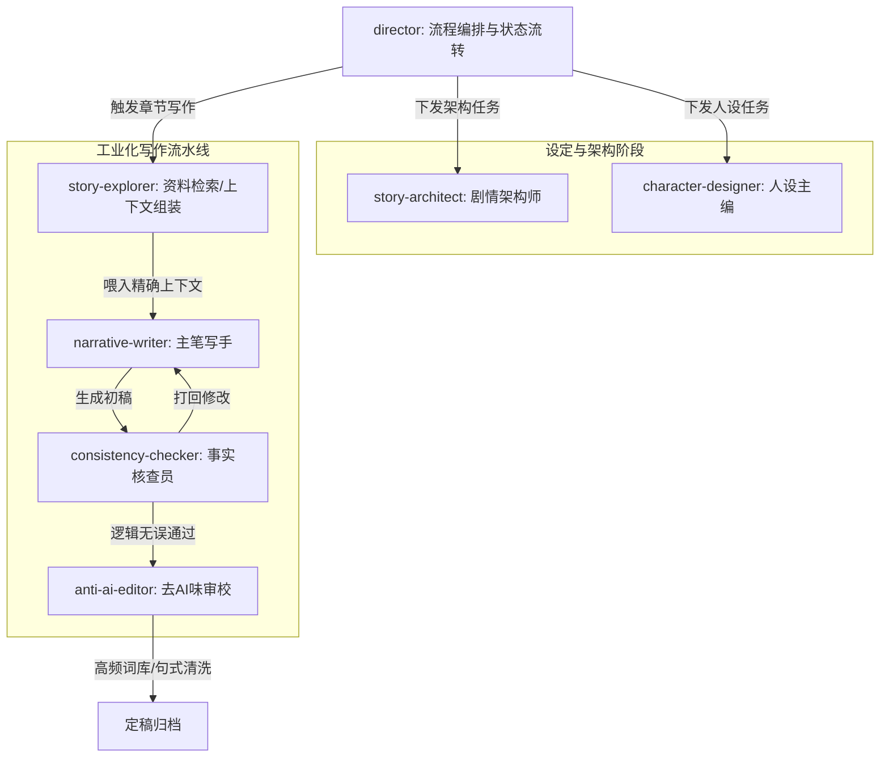

# AI Agent 工业级小说创作 Skill 体系重构设计 (Specs)

## 1. 背景与目标

### 1.1 当前痛点
现有的 8 个 Skill (`create-novel`, `export-novel`, `generate-chapter`, `generate-character`, `generate-outline`, `revise-setting`, `show-project`, `write-chapter`) 采用的是人类写作的线性映射，导致了在 LLM 执行时出现致命问题：
1. **全能型陷阱**：`write-chapter` 试图在一个 Prompt 中同时完成情节推进、人物刻画和文辞润色，导致 LLM 负载过高，输出质量平庸（“流水账”）。
2. **缺乏去 AI 味机制**：没有专门的审查环节对抗 LLM 固有的翻译腔、成语堆砌和说教感。
3. **记忆遗忘与上下文断裂**：缺乏在长篇创作中的自动事实核查（Consistency Checking），容易出现前后设定矛盾。

### 1.2 重构目标
以**“写出一篇优秀的网文小说”**为终极目标，将系统从“功能驱动的单体脚本”升级为**“专业编辑部多 Agent 协作 + 强制质量门禁”**架构。通过切分模型职责、引入自我博弈（起草 vs. 审校）和强制上下文加载，大幅提升成文质量。

---

## 2. 架构概览 (Approach A + B)

新架构结合了**多 Agent 角色模型**和**流水线质量门禁**。整个小说创作系统不再是单纯的“功能按键”，而是一个虚拟的“编辑部”。

### 协作拓扑：

---

## 3. 核心 Agent 职责定义

| 角色 (新 Skill 名) | 能力层级要求 | 核心职责与设计要点 |
| :--- | :--- | :--- |
| **`director`** (总导演) | 中/高级模型 | 替代原 `create-novel`。维护全局状态机，负责路由决策。它不写具体内容，只负责唤醒其他 Agent 并传递上下文状态。 |
| **`story-architect`** (剧情架构师) | 顶级模型 (如 Opus) | 负责三幕式、情绪弧线、高潮与反转设计。提供结构化的模板强制 LLM 选用（而非自由发散）。 |
| **`character-designer`** (人设主编) | 中级模型 (如 Sonnet) | 构建角色心理动机链、关系网络。强制要求区分不同角色的语言风格标签。 |
| **`story-explorer`** (资料提取员) | 基础模型 (如 Haiku) | 纯只读（Read Only）。在写作前，根据章节大纲自动检索出场人物档案和前置剧情，组装成紧凑的 Context 供主笔使用。 |
| **`narrative-writer`** (主笔写手) | 中级模型 (如 Sonnet) | 专注拉高情绪张力和场景描写。**写前强制门禁**：必须加载 Explorer 提供的内容；不能一次性写全章，需分节拍进行。 |
| **`consistency-checker`** (核查员) | 基础模型 (如 Haiku) | 纯只读比对。将初稿与知识库比对，检查“生死状态、地点、战力等级”等硬逻辑，产出 S1(阻断) / S2(严重) 级别修改建议。 |
| **`anti-ai-editor`** (去AI味审校)| 中/顶级模型 | **核心护城河**。拿着反 AI 词汇黑名单（如：不禁、宛如、然而）和段落密度规则（一句一段、短句为主），将浓重 LLM 味的初稿洗净成纯正网文风。 |

---

## 4. 关键规范与门禁约束 (Quality Gates)

重构后的系统必须在底层实现以下约束：

1. **Anti-Recursion Guard (防递归嵌套保护)**
   - 明确限制各 Agent 间的相互调用，例如 `narrative-writer` 绝不允许自主反向唤醒 `director`，防止发生上下文死循环炸毁。
2. **Pre-Write Context Loading (写前强制加载)**
   - 在任何生成正文的环节前，设立自检门禁：如果没有加载 `01-人物档案` 和 `02-上一章末尾 500 字`，必须立即阻断生成并回溯获取。
3. **Anti-AI Prompting (反 AI 味语料集)**
   - 将“去 AI 味规则”抽离为独立的公共 Markdown 参考文件（如 `references/anti-ai-rules.md`），在 `anti-ai-editor` 运行时动态注入，方便后续不断迭代屏蔽词库。
4. **Self-Driving Loop (自驱工作流)**
   - 用明确的 `WHILE` 伪代码和禁止语（如“禁止使用 AskUserQuestion”）约束写作流水线，在确定性任务（如批量提取摘要）中不需要人工步步确认。

---

## 5. 新旧资产迁移映射

*   `create-novel` / `show-project` ➔ 整合入 `director` 与项目状态报告。
*   `generate-outline` ➔ 升级并重构为 `story-architect`。
*   `generate-character` ➔ 升级并重构为 `character-designer`。
*   `generate-chapter` ➔ 拆分为大纲细化（Architect）和情节提取（Explorer）。
*   `write-chapter` ➔ **彻底废除单体脚本**，拆分为 `Writer` -> `Checker` -> `Editor` 三级工业化流水线。
*   `revise-setting` ➔ 融合进统一的只读核查链路中。
*   `export-novel` ➔ 保持为纯工具类脚本，增加异常降级处理。

## User Review Required
> [!IMPORTANT]
> - 本次重构是对整个工程骨架的颠覆，从“脚本式流水账”走向“Agentic 编辑部”。
> - 是否同意废弃原有的 8 个功能型 Skill，转而按照上述架构搭建全新的 Agent 系统？
> - 确认后，我们将进入下一环节：通过 `writing-plans` 编写极其详尽的代码/Prompt实现 TDD 实施计划。
