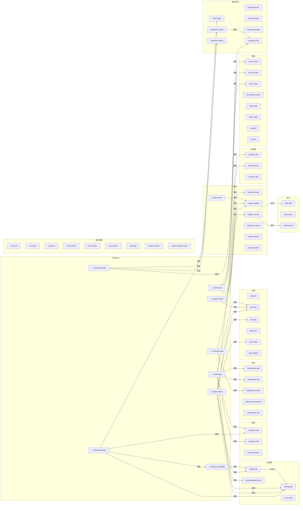

# Skill 依赖图

> 完整的 skill 间调用关系和数据流向。概览版见 [GUIDE.md](../GUIDE.md) §7。

---

## 1. 全局调用关系图



---

## 2. 协议嵌入关系

哪些 skill 内嵌了哪些协议：

```mermaid
graph TD
    subgraph "协议 Protocols"
        P_DP["draft-primacy<br/>草稿优先"]
        P_NR["name-resolution<br/>名字解析"]
        P_FE["from-extraction<br/>来源提取"]
        P_PF["preflight-integrity<br/>预检完整性"]
        P_OJ["operation-journal<br/>操作日志"]
        P_SL["style-lifecycle<br/>风格生命周期"]
        P_PE["post-edit-impact-scan<br/>编辑后扫描"]
        P_CS["chapter-scope-guard<br/>章节容量"]
        P_CA["chapter-auto-inference<br/>章节推断"]
        P_EG["eval-gate<br/>评估闸门"]
        P_CB["context-budget<br/>上下文预算"]
    end

    CD["chapter-draft"] -.-> P_NR & P_PF & P_OJ & P_CS & P_CA
    CU["chapter-update"] -.-> P_PF & P_SL & P_CA
    CK["pipeline-chapter-kickoff"] -.-> P_PF & P_OJ & P_CS
    DP_P["pipeline-draft-polish"] -.-> P_PF & P_SL & P_DP
    CE["character-edit"] -.-> P_NR & P_PE
    SE["setting-edit"] -.-> P_PE
    CA["character-add"] -.-> P_NR & P_FE
    SA["setting-add"] -.-> P_FE
    PA["plot-add"] -.-> P_FE
    DI["draft-ingest"] -.-> P_FE & P_DP
    AAR["anti-ai-rewrite"] -.-> P_NR & P_CA
    CR["chapter-review"] -.-> P_CA
    AAC["anti-ai-check"] -.-> P_CA
    VC["voice-check"] -.-> P_CA
    CON["consistency-check"] -.-> P_DP
```



---

## 3. 数据文件读写矩阵

### 3.1 核心数据文件 → 哪些 skill 会写它

| 数据文件 | 写入者 |
|----------|--------|
| `chapters/{id}.md` | chapter-create, chapter-draft, anti-ai-rewrite, hook-add, hook-resolve |
| `chapters/index.yaml` | chapter-create, chapter-update, chapter-draft, hook-add, hook-resolve |
| `characters/{name}.yaml` | character-add, character-edit, relationship-add, project-reindex |
| `characters/character_index.yaml` | character-add, character-edit, project-reindex |
| `characters/relations.yaml` | relationship-add, relationship-log, project-reindex |
| `characters/relation_events.yaml` | relationship-log |
| `plot/outline.md` | plot-init, plot-add, plot-edit, project-reindex |
| `plot/outline.yaml` | plot-init, plot-edit, hook-add, hook-resolve |
| `worldbuilding/entries/*.yaml` | setting-add, setting-edit, project-reindex |
| `worldbuilding/worldbuilding.yaml` | setting-add, setting-edit, project-reindex |
| `worldbuilding/setting.md` | setting-edit, pipeline-outline-bootstrap, pipeline-setting-consolidate |
| `timeline/main.yaml` | timeline-add |
| `.novel/state.yaml` | novel-init, novel-edit, chapter-create, chapter-update, plot-add, plot-edit, character-add, character-edit, setting-add, setting-edit, hook-add, hook-resolve, relationship-add, relationship-log, timeline-add, draft-ingest, pipeline-outline-bootstrap, pipeline-setting-consolidate, scene-add |
| `.novel/meta.yaml` | novel-init, novel-edit, chapter-create |
| `.novel/ops_log.yaml` | chapter-draft, pipeline-chapter-kickoff |
| `ingestion_brief.md` | draft-ingest |
| `shared/styles/templates.yaml` | style-create |
| `compliance/inspiration_log.yaml` | inspiration-log |
| `compliance/risk_report.yaml` | inspiration-check |
| `quality/ai_trace_report.yaml` | anti-ai-check |
| `scenes/*.yaml` | scene-add |
| `.novel/materials.yaml` | material-manage |

### 3.2 高频读取文件

被 10+ 个 skill 读取的文件（改动时影响面大）：

| 文件 | 读取者数量 | 说明 |
|------|-----------|------|
| `chapters/index.yaml` | **20+** | 几乎所有章节/大纲/检查类 skill 都读 |
| `.novel/state.yaml` | **15+** | 项目状态，管理和诊断类 skill 必读 |
| `characters/*.yaml` | **15+** | 角色档案，写作和检查类 skill 必读 |
| `plot/outline.md` | **12+** | 大纲，写作和审查类 skill 必读 |
| `worldbuilding/entries/*.yaml` | **10+** | 设定条目，一致性检查和写作 skill 必读 |
| `characters/relations.yaml` | **10+** | 关系图谱，写作和关系检查类 skill 必读 |

---

## 4. 典型工作流的调用链追踪

### 4.1 从零到发布第一章

```
用户: "我有个故事想法"
    │
    ▼
/novel-init "书名"
    │ 写: projects/书名/ 全部目录骨架
    ▼
/draft-ingest 草稿.txt
    │ 读: 草稿.txt
    │ 写: ingestion_brief.md
    ▼
/pipeline-outline-bootstrap
    │
    ├─► /setting-add ×N          写: worldbuilding/entries/*.yaml
    ├─► /pipeline-setting-consolidate
    │   └─► /setting-edit ×N     写: worldbuilding/entries/*.yaml
    ├─► /character-add ×N        写: characters/*.yaml
    │
    │ (用户确认大纲)
    │
    └─► 生成 plot/outline.md     写: plot/outline.md + outline.yaml
        │
        ▼
/pipeline-chapter-kickoff ch001
    │
    │ [preflight-integrity] ← 检查引用链
    │ [operation-journal]   ← 记录 in_progress
    │
    ├─► /chapter-create ch001    写: chapters/ch001.md, index.yaml
    ├─► /chapter-update ch001    写: index.yaml (元数据)
    ├─► /plot-add ch001 "场景"   写: chapters/ch001.md (场景大纲)
    │
    │ [operation-journal]   ← 更新 completed
    ▼
/chapter-draft ch001
    │
    │ [preflight-integrity] ← 预检
    │ [name-resolution]     ← 确定称呼
    │ [chapter-scope-guard] ← 容量检查
    │
    │ 读: outline, 角色卡, 设定, 时间线, 前章
    │ 写: chapters/ch001.md (正文), ops_log.yaml
    │
    ├─► /chapter-update ch001    写: index.yaml (status → draft)
    ▼
/pipeline-draft-polish ch001
    │
    │ [preflight-integrity]
    │
    ├─► /chapter-review ch001    (结构审查报告)
    ├─► /voice-check ch001       (声音检查报告)
    ├─► /anti-ai-check ch001     写: quality/ai_trace_report.yaml
    ├─► /anti-ai-rewrite ch001   写: chapters/ch001.md (改写)
    │   [name-resolution] ← 保留原有称呼
    │
    │ [style-lifecycle] ← 漂移检测
    │ [draft-primacy]   ← 冲突检测
    │ [eval-gate]       ← 闸门检查（分数 < 阈值则阻断）
    │
    └─► /chapter-update ch001    写: index.yaml (status → revise)（需闸门通过或 --force）
        │
        ▼
/pipeline-compliance-gate ch001
    ├─► /inspiration-log         写: compliance/inspiration_log.yaml
    ├─► /inspiration-check       写: compliance/risk_report.yaml
    └─► /inspiration-report      (输出报告)
```

### 4.2 修改角色后的影响链

```
/character-edit 赵宋 "增加新特征"
    │
    │ [post-edit-impact-scan]
    │   读: chapters/index.yaml → 筛选含"赵宋"的章节
    │   对每个相关章节检查冲突
    │
    └─► 输出：
        "⚠️ ch003 中赵宋的行为与新增特征可能矛盾（L45: '...'）"
        "建议检查：/consistency-check --chapter ch003"
```

### 4.3 修改设定后的影响链

```
/setting-edit rule_001 "修改污染机制"
    │
    │ [post-edit-impact-scan]
    │   读: chapters/index.yaml → 检查引用此设定的章节
    │   读: characters/*.yaml → 检查引用此设定的角色
    │
    ├─► 若使用 --evolve：
    │   └─► /setting-add rule_001b (新版本, supersedes: rule_001)
    │       写: worldbuilding/entries/rule_001b.yaml
    │       写: worldbuilding/entries/rule_001.yaml (superseded_by: rule_001b)
    │
    └─► 输出影响报告
```
